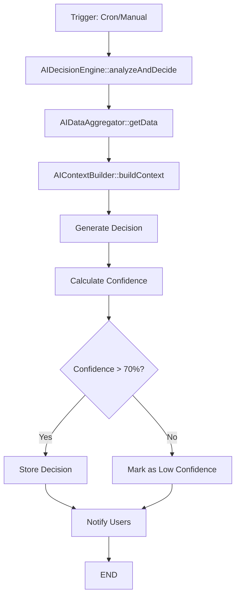
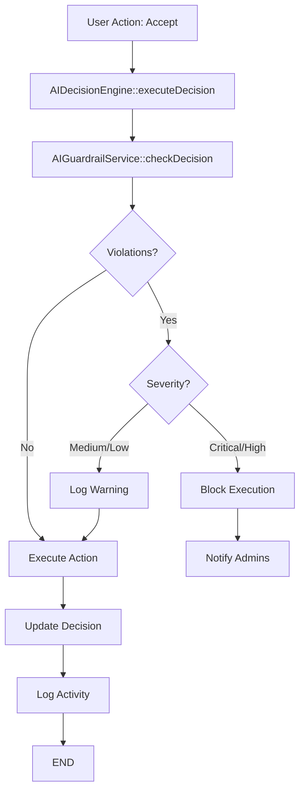

# 🔧 دليل المطور - نظام الذكاء الاصطناعي

## المحتويات
1. [معمارية النظام](#معمارية-النظام)
2. [هيكل المشروع](#هيكل-المشروع)
3. [الخدمات الأساسية](#الخدمات-الأساسية)
4. [قاعدة البيانات](#قاعدة-البيانات)
5. [Workflows & Processes](#workflows--processes)
6. [التوسع والتطوير](#التوسع-والتطوير)
7. [Testing](#testing)
8. [Deployment](#deployment)

---

## معمارية النظام

### نظرة عامة

```
┌─────────────────────────────────────────────────────────────────┐
│                        Laravel Application                       │
├─────────────────────────────────────────────────────────────────┤
│                                                                  │
│  ┌──────────────┐  ┌──────────────┐  ┌──────────────┐         │
│  │ Controllers  │  │   Services   │  │    Models    │         │
│  │              │  │              │  │              │         │
│  │ AIDecision   │──│ AIAnalysis   │──│ AIDecision   │         │
│  │ AIPrompt     │  │ AIContext    │  │ Task         │         │
│  │ AIInsights   │  │ AIGuardrail  │  │ Project      │         │
│  │ AIFeatures   │  │ AIData       │  │ User         │         │
│  └──────────────┘  └──────────────┘  └──────────────┘         │
│                                                                  │
│  ┌──────────────────────────────────────────────────────────┐  │
│  │                    Middleware Layer                       │  │
│  │  - Authentication                                         │  │
│  │  - Authorization (Permissions)                           │  │
│  │  - AI System Check                                        │  │
│  └──────────────────────────────────────────────────────────┘  │
│                                                                  │
│  ┌──────────────────────────────────────────────────────────┐  │
│  │                  Database Layer                           │  │
│  │  - PostgreSQL/MySQL                                       │  │
│  │  - Redis (Caching)                                        │  │
│  │  - AI Views (Optimized queries)                          │  │
│  └──────────────────────────────────────────────────────────┘  │
│                                                                  │
│  ┌──────────────────────────────────────────────────────────┐  │
│  │                  External Services                        │  │
│  │  - AI Provider (Future: OpenAI, etc.)                    │  │
│  │  - Email Service                                          │  │
│  │  - Activity Logging (Spatie)                             │  │
│  └──────────────────────────────────────────────────────────┘  │
│                                                                  │
└─────────────────────────────────────────────────────────────────┘
```

### Design Patterns

#### 1. Service Layer Pattern
```php
Controllers → Services → Models → Database
```
- Controllers: HTTP handling only
- Services: Business logic
- Models: Data access

#### 2. Repository Pattern (Implicit via Eloquent)
```php
Service → Model (Repository) → Database
```

#### 3. Strategy Pattern (Guardrails)
```php
Each guardrail rule = separate strategy
```

---

## هيكل المشروع

```
app/
├── Http/
│   ├── Controllers/
│   │   └── Admin/
│   │       └── AI/
│   │           ├── AIControlController.php       # لوحة التحكم الرئيسية
│   │           ├── AIDecisionController.php      # إدارة القرارات
│   │           ├── AIPromptController.php        # إدارة Prompts
│   │           ├── AIInsightsController.php      # لوحة الرؤى
│   │           ├── AIGuardrailController.php     # إعدادات الأمان
│   │           └── AIFeaturesController.php      # الميزات المتقدمة
│   │
│   └── Middleware/
│       └── CheckAIPermission.php                 # التحقق من صلاحيات AI
│
├── Models/
│   └── AI/
│       ├── AIDecision.php                        # نموذج القرارات
│       ├── AIPromptTemplate.php                  # نموذج القوالب
│       └── (Future: AIAnalysis, AIInsight)
│
├── Services/
│   └── AI/
│       ├── AIAnalysisService.php                 # تحليل المشاريع/المهام
│       ├── AIDataAggregator.php                  # جمع البيانات
│       ├── AIContextBuilder.php                  # بناء السياق
│       ├── AIPromptTemplateService.php           # إدارة القوالب
│       ├── AIDecisionEngine.php                  # محرك القرارات
│       └── AIGuardrailService.php                # حواجز الأمان
│
├── Notifications/
│   ├── NewAIDecisionNotification.php             # تنبيهات القرارات
│   └── GuardrailViolationNotification.php        # تنبيهات الانتهاكات
│
└── Console/
    └── Commands/
        └── AnalyzeTasksAndProjects.php           # أمر التحليل الدوري

database/
├── migrations/
│   ├── *_create_ai_decisions_table.php
│   ├── *_create_ai_prompt_templates_table.php
│   ├── *_create_ai_database_views.php
│   └── *_add_guardrail_violations_to_ai_decisions_table.php
│
└── sql/
    ├── ai_enriched_tasks.sql                     # View للمهام المدعمة
    └── ai_project_metrics.sql                    # View لمقاييس المشاريع

resources/
└── views/
    └── admin/
        ├── ai-control/index.blade.php            # لوحة التحكم
        ├── ai-decisions/
        │   ├── index.blade.php                   # قائمة القرارات
        │   └── show.blade.php                    # تفاصيل القرار
        ├── ai-prompts/
        │   ├── index.blade.php                   # قائمة القوالب
        │   ├── create.blade.php                  # إنشاء قالب
        │   ├── edit.blade.php                    # تعديل قالب
        │   └── show.blade.php                    # عرض قالب
        ├── ai-insights/
        │   └── index.blade.php                   # لوحة الرؤى
        ├── ai-guardrails/
        │   └── index.blade.php                   # إعدادات الأمان
        └── ai-features/
            └── index.blade.php                   # الميزات المتقدمة

routes/
└── ai.php                                        # جميع routes الـ AI

docs/
├── USER_GUIDE.md                                 # دليل المستخدم
├── DEVELOPER_GUIDE.md                            # دليل المطور
└── API_DOCUMENTATION.md                          # توثيق API
```

---

## الخدمات الأساسية

### 1. AIDataAggregator

**المسؤولية:** جمع وتجميع البيانات من قاعدة البيانات

```php
namespace App\Services\AI;

class AIDataAggregator
{
    /**
     * Fetch enriched tasks data
     */
    public function getEnrichedTasks(array $filters = []): Collection
    {
        $cacheKey = 'ai_enriched_tasks_' . md5(json_encode($filters));
        
        return Cache::remember($cacheKey, 3600, function () use ($filters) {
            return DB::table('ai_enriched_tasks')
                ->when(!empty($filters), function ($query) use ($filters) {
                    // Apply filters
                })
                ->get();
        });
    }
    
    /**
     * Get project metrics
     */
    public function getProjectMetrics(int $projectId): array
    {
        // Implementation...
    }
}
```

**Key Methods:**
- `getEnrichedTasks()`: Tasks مع بيانات إضافية
- `getProjectMetrics()`: مقاييس المشروع
- `getCachedData()`: البيانات المؤقتة
- `clearCache()`: مسح الـ cache

### 2. AIContextBuilder

**المسؤولية:** بناء السياق للتحليل

```php
namespace App\Services\AI;

class AIContextBuilder
{
    /**
     * Build task context
     */
    public function buildTaskContext(Task $task): array
    {
        return [
            'task_data' => [
                'id' => $task->id,
                'title' => $task->title,
                'status' => $task->status,
                'priority' => $task->priority,
                // ...
            ],
            'project_context' => $this->getProjectContext($task->project),
            'historical_data' => $this->getHistoricalData($task),
            'team_context' => $this->getTeamContext($task),
        ];
    }
}
```

**Key Methods:**
- `buildTaskContext()`: سياق المهمة
- `buildProjectContext()`: سياق المشروع
- `getHistoricalData()`: البيانات التاريخية
- `enrichContext()`: إثراء السياق

### 3. AIDecisionEngine

**المسؤولية:** محرك اتخاذ القرارات

```php
namespace App\Services\AI;

class AIDecisionEngine
{
    protected AIDataAggregator $dataAggregator;
    protected AIContextBuilder $contextBuilder;
    protected AIGuardrailService $guardrailService;
    
    /**
     * Analyze and generate decisions
     */
    public function analyzeAndDecide(
        string $entityType, 
        int $entityId
    ): ?AIDecision {
        // 1. Gather data
        $data = $this->dataAggregator->getData($entityType, $entityId);
        
        // 2. Build context
        $context = $this->contextBuilder->build($entityType, $data);
        
        // 3. Generate decision
        $decision = $this->generateDecision($context);
        
        // 4. Store decision
        return $decision->save() ? $decision : null;
    }
    
    /**
     * Execute decision
     */
    public function executeDecision(AIDecision $decision): bool
    {
        // 1. Check guardrails
        $guardrailCheck = $this->guardrailService->checkDecision($decision);
        
        if (!$guardrailCheck['passed']) {
            // Log violations
            $decision->update([
                'guardrail_violations' => $guardrailCheck['total_violations'],
                'guardrail_check' => $guardrailCheck,
            ]);
            
            // Block critical/high
            if (in_array($guardrailCheck['highest_severity'], ['critical', 'high'])) {
                $this->notifyViolation($decision, $guardrailCheck);
                return false;
            }
        }
        
        // 2. Execute action
        // ...
        
        // 3. Log execution
        activity('ai')->causedBy(auth()->user())
            ->performedOn($decision)
            ->log('decision_executed');
            
        return true;
    }
}
```

**Key Methods:**
- `analyzeAndDecide()`: تحليل وتوليد قرار
- `executeDecision()`: تنفيذ قرار
- `generateDecision()`: توليد القرار
- `calculateConfidence()`: حساب الثقة

### 4. AIGuardrailService

**المسؤولية:** حواجز الأمان

```php
namespace App\Services\AI;

class AIGuardrailService
{
    /**
     * Check decision against guardrails
     */
    public function checkDecision(AIDecision $decision): array
    {
        $violations = [];
        $rules = $this->getActiveRules();
        
        // Rule 1: No data deletion
        if ($rules['no_data_deletion'] && $this->involvesDataDeletion($decision)) {
            $violations[] = [
                'rule' => 'no_data_deletion',
                'severity' => 'critical',
                'message' => 'Decision involves data deletion',
                'recommendation' => 'Mark for manual review',
            ];
        }
        
        // Rule 2: No critical changes
        if ($rules['no_critical_changes'] && $this->isCriticalChange($decision)) {
            $violations[] = [
                'rule' => 'no_critical_changes',
                'severity' => 'high',
                'message' => 'Critical change detected',
                'recommendation' => 'Requires approval',
            ];
        }
        
        // Rule 3: No mass changes
        if ($rules['no_mass_changes'] && $this->isMassChange($decision)) {
            $violations[] = [
                'rule' => 'no_mass_changes',
                'severity' => 'high',
                'message' => 'Mass change exceeds threshold',
                'recommendation' => 'Split into smaller batches',
            ];
        }
        
        // Rule 4: No unverified actions
        if ($rules['no_unverified_actions'] && $this->isLowConfidence($decision)) {
            $violations[] = [
                'rule' => 'no_unverified_actions',
                'severity' => 'medium',
                'message' => 'Confidence below threshold',
                'recommendation' => 'Requires manual verification',
            ];
        }
        
        return [
            'passed' => empty($violations),
            'violations' => $violations,
            'total_violations' => count($violations),
            'highest_severity' => $this->getHighestSeverity($violations),
        ];
    }
}
```

**Key Methods:**
- `checkDecision()`: فحص القرار
- `getActiveRules()`: القواعد المفعّلة
- `updateRule()`: تحديث قاعدة
- `updateThreshold()`: تحديث حد
- `getStatistics()`: إحصائيات

### 5. AIAnalysisService

**المسؤولية:** التحليلات المتقدمة

```php
namespace App\Services\AI;

class AIAnalysisService
{
    /**
     * Get system insights
     */
    public function getSystemInsights(): array
    {
        return [
            'health_score' => $this->calculateHealthScore(),
            'system_status' => $this->determineSystemStatus(),
            'metrics' => $this->getKeyMetrics(),
            'trends' => $this->analyzeTrends(),
        ];
    }
    
    /**
     * Analyze trends
     */
    public function analyzeTrends(): array
    {
        return [
            'acceptance_trend' => $this->getAcceptanceTrend(),
            'confidence_trend' => $this->getConfidenceTrend(),
            'volume_trend' => $this->getVolumeTrend(),
        ];
    }
}
```

---

## قاعدة البيانات

### الجداول الرئيسية

#### 1. `ai_decisions`

```sql
CREATE TABLE ai_decisions (
    id BIGINT UNSIGNED PRIMARY KEY AUTO_INCREMENT,
    decision_type VARCHAR(255) NOT NULL,
    entity_type VARCHAR(255) NOT NULL,
    entity_id BIGINT UNSIGNED NOT NULL,
    task_id BIGINT UNSIGNED NULL,
    project_id BIGINT UNSIGNED NULL,
    recommendation TEXT NOT NULL,
    reasoning JSON NOT NULL,
    confidence_score DECIMAL(5,4) NOT NULL,
    alternatives JSON NULL,
    user_action VARCHAR(50) DEFAULT 'pending',
    user_comment TEXT NULL,
    reviewed_by BIGINT UNSIGNED NULL,
    reviewed_at TIMESTAMP NULL,
    executed_at TIMESTAMP NULL,
    execution_result JSON NULL,
    guardrail_violations INT DEFAULT 0,
    guardrail_check JSON NULL,
    created_at TIMESTAMP DEFAULT CURRENT_TIMESTAMP,
    updated_at TIMESTAMP DEFAULT CURRENT_TIMESTAMP ON UPDATE CURRENT_TIMESTAMP,
    
    INDEX idx_entity (entity_type, entity_id),
    INDEX idx_task (task_id),
    INDEX idx_project (project_id),
    INDEX idx_user_action (user_action),
    INDEX idx_decision_type (decision_type)
);
```

#### 2. `ai_prompt_templates`

```sql
CREATE TABLE ai_prompt_templates (
    id BIGINT UNSIGNED PRIMARY KEY AUTO_INCREMENT,
    name VARCHAR(255) NOT NULL UNIQUE,
    description TEXT NULL,
    category VARCHAR(100) NOT NULL,
    template TEXT NOT NULL,
    variables JSON NULL,
    version INT DEFAULT 1,
    is_active BOOLEAN DEFAULT TRUE,
    usage_count INT DEFAULT 0,
    last_used_at TIMESTAMP NULL,
    created_by BIGINT UNSIGNED NULL,
    created_at TIMESTAMP DEFAULT CURRENT_TIMESTAMP,
    updated_at TIMESTAMP DEFAULT CURRENT_TIMESTAMP ON UPDATE CURRENT_TIMESTAMP,
    
    INDEX idx_category (category),
    INDEX idx_active (is_active)
);
```

### الـ Views المُحسّنة

#### 1. `ai_enriched_tasks`

```sql
CREATE VIEW ai_enriched_tasks AS
SELECT 
    t.id,
    t.title,
    t.description,
    t.status,
    t.priority,
    t.due_date,
    t.assigned_to,
    t.project_id,
    p.title as project_title,
    p.priority as project_priority,
    u.name as assignee_name,
    -- Task metrics
    DATEDIFF(t.due_date, NOW()) as days_until_due,
    CASE 
        WHEN t.due_date < NOW() THEN TRUE 
        ELSE FALSE 
    END as is_overdue,
    -- Other enriched data...
FROM tasks t
LEFT JOIN projects p ON t.project_id = p.id
LEFT JOIN users u ON t.assigned_to = u.id;
```

#### 2. `ai_project_metrics`

```sql
CREATE VIEW ai_project_metrics AS
SELECT 
    p.id,
    p.title,
    p.status,
    p.priority,
    p.budget,
    p.start_date,
    p.end_date,
    COUNT(t.id) as total_tasks,
    SUM(CASE WHEN t.status = 'completed' THEN 1 ELSE 0 END) as completed_tasks,
    -- Metrics...
FROM projects p
LEFT JOIN tasks t ON p.id = t.project_id
GROUP BY p.id;
```

---

## Workflows & Processes

### Decision Generation Workflow



### Decision Execution Workflow



---

## التوسع والتطوير

### إضافة قرار جديد

```php
// 1. Create decision type constant
class AIDecision extends Model
{
    const TYPE_YOUR_NEW_TYPE = 'your_new_type';
}

// 2. Add generation logic in AIDecisionEngine
protected function generateDecision(array $context): array
{
    // Your logic...
    return [
        'decision_type' => AIDecision::TYPE_YOUR_NEW_TYPE,
        'recommendation' => '...',
        'reasoning' => [...],
        'confidence_score' => 0.85,
    ];
}

// 3. Add execution logic
protected function executeYourNewType(AIDecision $decision): bool
{
    // Implementation...
    return true;
}
```

### إضافة guardrail جديد

```php
// In AIGuardrailService

protected function checkYourNewRule(AIDecision $decision): bool
{
    // Your logic...
    return $violates;
}

// Add to checkDecision method
if ($rules['your_new_rule'] && $this->checkYourNewRule($decision)) {
    $violations[] = [
        'rule' => 'your_new_rule',
        'severity' => 'high',
        'message' => '...',
        'recommendation' => '...',
    ];
}
```

---

## Testing

### Unit Tests

```php
// tests/Unit/Services/AIGuardrailServiceTest.php

class AIGuardrailServiceTest extends TestCase
{
    public function test_no_data_deletion_rule()
    {
        $service = new AIGuardrailService();
        $decision = AIDecision::factory()->create([
            'decision_type' => 'delete_task',
        ]);
        
        $result = $service->checkDecision($decision);
        
        $this->assertFalse($result['passed']);
        $this->assertEquals('critical', $result['highest_severity']);
    }
}
```

### Feature Tests

```php
// tests/Feature/AI/DecisionControllerTest.php

class DecisionControllerTest extends TestCase
{
    public function test_user_can_view_decisions()
    {
        $user = User::factory()->create();
        $user->givePermissionTo('view-ai-decisions');
        
        $response = $this->actingAs($user)
            ->get(route('ai.decisions.index'));
            
        $response->assertStatus(200);
    }
}
```

---

## Deployment

### Environment Variables

```env
# AI Configuration
AI_SYSTEM_ENABLED=true
AI_CACHE_TTL=3600
AI_ANALYSIS_CRON="0 2 * * *"

# Guardrails
AI_GUARDRAIL_MASS_LIMIT=5
AI_GUARDRAIL_MIN_CONFIDENCE=0.7
```

### Artisan Commands

```bash
# Run AI analysis
php artisan ai:analyze

# Clear AI cache
php artisan cache:forget ai_*

# Test guardrails
php artisan tinker
>>> app(AIGuardrailService::class)->checkDecision($decision)
```

---

## Best Practices

### ✅ Do's

- Always use service layer for business logic
- Cache expensive queries
- Log all AI actions via Activity Log
- Validate user permissions
- Use transactions for multi-step operations
- Test guardrails thoroughly

### ❌ Don'ts

- Don't put business logic in controllers
- Don't bypass guardrails
- Don't expose sensitive data in logs
- Don't execute decisions without checks
- Don't forget to update documentation

---

**آخر تحديث:** يناير 2026  
**الإصدار:** 2.0.0
